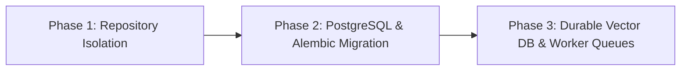

# CampusMIND 2.0 — Database & Infrastructure Migration Strategy

## Overview

Phase 1 establishes a repository pattern and data-access isolation layer (`backend/db/session.py`, `backend/repositories/`). This design allows CampusMIND to transition seamlessly from the current local SQLite development database to production-grade PostgreSQL and durable vector infrastructure in subsequent phases without modifying API routes or business services.

---

## Phase Transition Roadmap

---

## PostgreSQL Migration Strategy (Planned Phase 2)

### 1. Database Connection Abstraction
In Phase 1, `backend/db/session.py` provides SQLite connections via `get_db_connection()`. In Phase 2, `backend/db/session.py` will be updated to instantiate a SQLAlchemy / AsyncPG engine when `DATABASE_URL` starts with `postgresql://` or `postgresql+asyncpg://`.

### 2. Alembic Migration Setup
- Alembic will be initialized in `backend/migrations/`.
- Initial baseline migration scripts will generate PostgreSQL schemas matching `students`, `query_logs`, and `query_feedback` tables.
- Data migration scripts (`scripts/migrate_sqlite_to_pg.py`) will read records from `campusmind.db` and insert them cleanly into PostgreSQL with proper transaction constraints and indexes.

### 3. Key Indexes & Performance Optimization
- Index on `students(enrollment_no)` (unique, case-insensitive index).
- Index on `query_logs(timestamp)` and `query_logs(username)`.
- Index on `query_feedback(query_id)`.

---

## Durable Vector Storage Strategy (Planned Phase 3)

### Current Baseline (Phase 1)
- Local ChromaDB directory (`./backend/chroma_db`) storing embeddings generated by `sentence-transformers`.

### Future Target Architecture
- Transition to `pgvector` extension inside PostgreSQL or an isolated `Qdrant` vector database instance.
- Decouple embedding ingestion into background worker queues (Celery / Redis) to avoid running ingestion in background threads on API startup.

---

## Verification & Rollback Safeguards

1. **Dual-Driver Verification**: The repository layer will be tested against both SQLite (for fast local dev/testing) and PostgreSQL (for production integration tests).
2. **Zero Route Impact**: Because API routes invoke `StudentService` and `AuditService`, which consume `StudentRepository` and `AuditRepository`, schema and driver changes in Phase 2 require zero modifications to route signatures or security RBAC logic.
