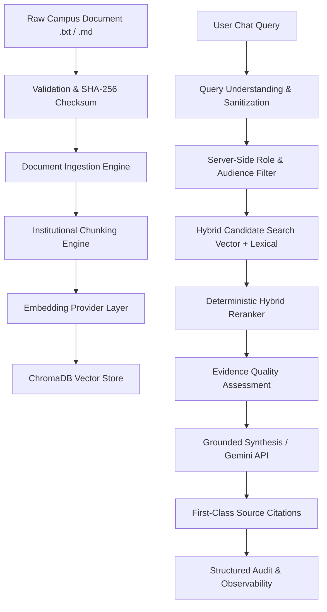

# CampusMIND 2.0 — Advanced RAG & Campus Intelligence Engine Architecture

## 1. Overview

Phase 4 transforms CampusMIND into a production-grade institutional knowledge engine. The platform provides end-to-end processing for institutional documents, enforcing strict server-side access control, context grounding, prompt-injection defense, and evidence quality signals.

---

## 2. Ingestion Architecture

- **Document Validation**: Verifies file existence, `.txt`/`.md` format support, non-empty content, and UTF-8 encoding.
- **Identity & Checksums**: Computes SHA-256 content hashes to establish deterministic document identity.
- **Idempotency & Versioning**: 
  - Same document + same checksum -> skips vector re-indexing (`unchanged` status).
  - Modified document + changed checksum -> purges stale vectors from ChromaDB, increments version (e.g. `1.0` -> `1.1`), re-chunks, and re-indexes (`indexed` status).
- **Metadata Synchronization**: Synchronizes document metadata state with relational `KnowledgeDocument` records in SQLite/PostgreSQL.

---

## 3. Intelligent Chunking

- **Structure Awareness**: `InstitutionalChunker` splits documents along section boundaries, headings (`#`, `##`, uppercase titles), paragraphs (`\n\n`), bullet points, and tables.
- **Chunk Parameters**: Default chunk size = 500 characters, overlap = 80 characters.
- **Enriched Metadata**: Every chunk contains `document_id`, `document_name`, `version`, `category`, `section`, `audience`, `source_path`, `checksum`, and `chunk_index`.

---

## 4. Embedding & Vector Store Architecture

- **Provider Abstraction**: Decoupled `EmbeddingProvider` interface with support for local SentenceTransformers (`all-MiniLM-L6-v2`), Gemini embeddings, and deterministic Mock fallback.
- **Vector Store Abstraction**: `VectorStore` encapsulates ChromaDB `PersistentClient` operations: `upsert()`, `query()`, `delete()`, `delete_document_chunks()`, and `health_check()`.

---

## 5. Hybrid Retrieval & Server-Side Authorization

- **Hybrid Scoring**: Combines vector cosine similarity with lexical TF-IDF keyword match density.
- **Role-Aware Filtering**: Server-side role check (`student`, `faculty`, `admin`) enforces document audience boundaries (`all`, `students`, `faculty`, `admin`). Frontend headers/parameters are never trusted for role checks.
- **Student Data Isolation Boundary**: Private student directory records (`ifhe_student_directory_records.txt`) are excluded from vector search and accessible ONLY through authorized relational database lookups (`StudentRepository` + IDOR authorization checks).

---

## 6. Reranking & Evidence Quality Scoring

- **Hybrid Reranker**: `DeterministicHybridReranker` calculates a composite score combining vector similarity (0.6 weight), lexical density (0.4 weight), and title bonus.
- **Evidence Quality Signal**:
  - `high`: Multiple strong matching sources (score >= 0.65).
  - `medium`: Adequate matching sources (score >= 0.45).
  - `low`: Weak matching evidence.
  - `insufficient`: No candidates meeting similarity threshold (`0.25`).

---

## 7. Grounded Answer Synthesis & Prompt Injection Defenses

- **Strict Context Grounding**: LLM prompt templates frame retrieved text within `<retrieved_context_untrusted_data>` boundaries.
- **Zero Hallucination**: If evidence quality is `insufficient`, system immediately returns standard fallback: `"I don't have information on that in the official campus database."` without invoking LLM synthesis.
- **Prompt Injection Resilience**: Passive XML framing prevents document text from overriding system instructions or revealing hidden secrets.

---

## 8. First-Class Citations & Evaluation Framework

- **Citations**: Returns source title, section, category, version, relevance score, and snippet excerpt.
- **Benchmark Evaluator**: `RAGEvaluator` computes hit rate, citation presence rate, unauthorized retrieval rate (0.0% target), and out-of-domain refusal rate.
