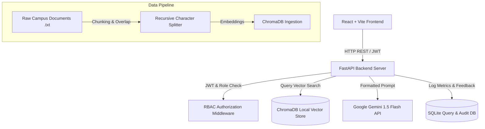

# CampusMind System Architecture

## Architecture Diagram

## System Breakdown

1. **Ingestion & Vector Indexing**:
   - `rag/chunker.py`: Splits documents into 500-character chunks with an 80-character overlap.
   - `rag/ingest.py`: Encodes text using `sentence-transformers` (`all-MiniLM-L6-v2`) and upserts to ChromaDB with metadata (document_name, allowed_roles).

2. **Role-Based Access Control (RBAC)**:
   - Server-side filtering enforces role boundaries (`student`, `faculty`, `admin`).
   - If a student queries a faculty-restricted notice, ChromaDB metadata filter omits the chunk.

3. **Hallucination Prevention**:
   - Cosine similarity scores below `0.45` trigger an immediate fallback response ("I don't have information on that in the official campus database.") without calling the LLM.
