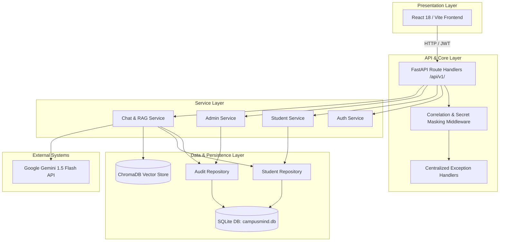

# CampusMIND 2.0 — System Architecture Document

## Overview

CampusMIND 2.0 is designed as a modular monolith campus intelligence platform. The system decouples presentation, route handling, business logic, data persistence, and vector retrieval into explicit, clean architectural boundaries.

---

## Key Architectural Principles

1. **Modular Monolith Layout**: Single backend repository organized by responsibility (`core/`, `db/`, `repositories/`, `services/`, `api/`, `models/`, `auth/`, `rag/`).
2. **Repository Pattern**: All database persistence is encapsulated inside repositories (`StudentRepository`, `AuditRepository`). Raw SQL statements are forbidden inside API route handlers.
3. **Service Layer**: Business rules, role authorization logic, and rate limiting reside inside domain services.
4. **Environment-Based Configuration**: Fail-closed configuration (`core/config.py`) enforcing strict production security rules (unique secrets, no demo mode in production, explicit CORS origins).
5. **API Versioning**: Standardized `/api/v1/` prefix with backwards-compatible `/api/` alias mounts for legacy callers.
6. **Structured Observability**: Centralized logging (`core/logging.py`) equipped with an automated `SecretMaskingFilter` that redacts passwords, JWTs, and API keys. Every request is assigned a unique `X-Request-ID`.

---

## Component Boundaries

| Module | Responsibility |
| :--- | :--- |
| `backend/core/` | Global settings, secret-masking logging, request correlation middleware. |
| `backend/db/` | Database connection management and connection session factories. |
| `backend/repositories/` | Direct SQL data access and persistence abstraction layer. |
| `backend/services/` | Business logic processing, rate-limiting, and domain workflows. |
| `backend/api/` | FastAPI routes, input validation, and HTTP status code formatting. |
| `backend/models/` | Pydantic request/response schemas and domain data contracts. |
| `backend/auth/` | JWT token generation, decoding, and server-side RBAC validation. |
| `backend/rag/` | Document chunking, embedding generation, and ChromaDB vector retrieval. |
