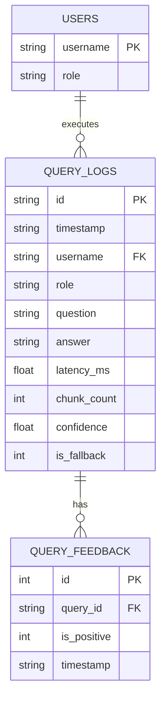

# CampusMind Entity-Relationship (ER) Diagram

```mermaid
erDiagram
    QUERY_LOGS ||--o{ QUERY_FEEDBACK : has
    USERS ||--o{ QUERY_LOGS : executes

    USERS {
        string username PK
        string role
    }

    QUERY_LOGS {
        string id PK
        string timestamp
        string username FK
        string role
        string question
        string answer
        float latency_ms
        int chunk_count
        float confidence
        int is_fallback
    }

    QUERY_FEEDBACK {
        int id PK
        string query_id FK
        int is_positive
        string timestamp
    }
```
